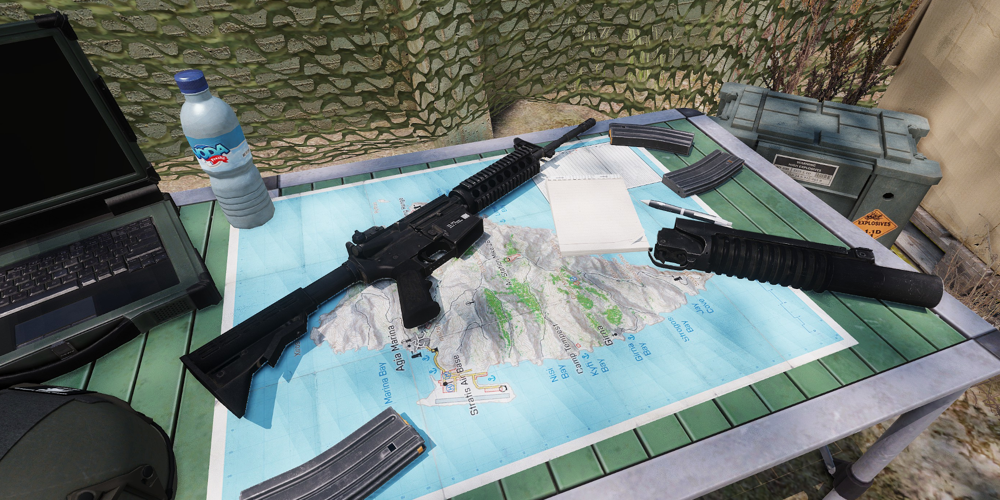

# SUCK - Simple UBGL Conversion Kit

SUCK is an Arma 3 mod that allows Players to attach and detach their underbarrel granade launcher (UGL).
It uses placeholder items for different UGL models and is compatible with ACE3 and RHS.

## Acronyms

Simple Underbarrel-Grenade-Launcher Conversion Kit
Switch UGL Conversion Kit
Steffies UGL Conversion Kit
SUGLUK - Switch Underbarrel Granade Launcher Upgrade Kit

## Concept

This Mod should support to attach and detach an UGL.
Because UGL is no attachment like a scope or a Bipod the whole Weapon has to be switched.
Therefore only a limited range of weapons can be suported which have a UGL counterpart.
A mapping of UGL model, base weapon and UGL Weapon is saved an action to attach/detach is shown when current Weapon is supported.
The UGL itself is represented by a dummy item, that is created on detach and needs to be present for attaching.

### Components

For this concept following components are required:

- items for different UGL Models (ToDo)
- scripts to change Weapons (ToDo)
- mapping for supported mapping (ToDo)
- mod icon (WIP)
- 2d model icon for item
- (otional) 3d model for item on ground (ToDo)

### Models

Several UGL Models schuld be available seperately:
- M203
- M203S
- M320
- HK AG36 (G36)
- GP25 (AK)
- FM EGLM (SCAR)
- (optional) various vanilla launchers

## Features

- swap Weapons using scrollwheel menu (planned)
- swap Weapons using ace menu (planned)
- (otional) swap Weapons by dragging on attachment slot (planned)
- (otional) swap Weapons by right click item (planned)
- (otional) universal UGL item that works for all models (planned)

## Compatablity

- Vanilla UGLs (planned)
- ace3 menue
- RHS UGLs (planned)
- CUP UGLs (planned)
- BWMod UGLs (planned)
- Niarms UGLs (planned)

## Usage (Preview)

## Development Usage

Use Mikeros pboProject, Full Build, Output = `P:\dcd\dcd_suck_export`, Source = `P:\dcd\dcd_suck`

- **Only** touch `\dcd_suck_export\Mod.cpp`, let the rest be generated
- **Only** put actual build content into `\dcd_suck`
- WIP & Raw content belongs to `\source`

## Disclaimer / License

<a rel="license" href="http://www.bistudio.com/licenses/arma-public-license-share-alike" target="_blank" >
 
  
 This work is licensed under a Arma Public License Share Alike
</a>
